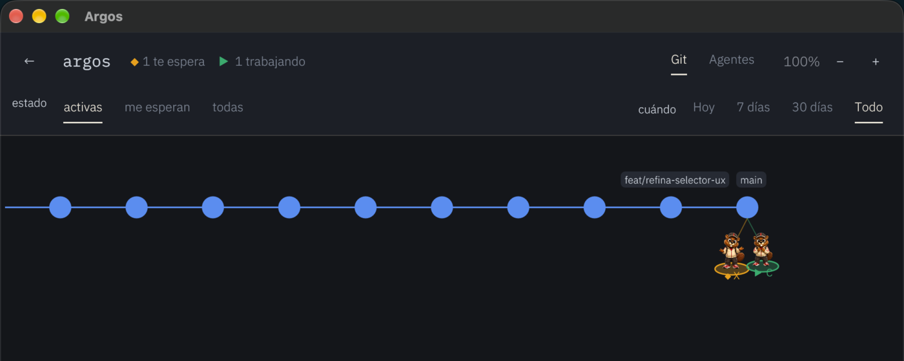

# Argos

*[Read this in English](README.md)*

Un monitor de escritorio, en Rust, para agentes de IA que corren como CLIs.

Cuando tienes Claude Code, Codex, Gemini y Antigravity abiertos a la vez en
varias pestañas de Warp y sobre varios proyectos, pierdes la cuenta de quién
está haciendo qué. Argos responde a una sola pregunta, de un vistazo:

> **qué agente, de qué compañía, está trabajando en qué rama — y en qué estado.**

Y te lleva a esa terminal de un clic.



## Qué hace

- **Cuatro plataformas.** Claude Code, Codex, Gemini CLI y Antigravity (`agy`),
  cada una con su sonda: leen los registros que cada CLI deja en disco.
- **Cuatro estados**, con símbolo además de color: *esperando* ◆, *trabajando* ▶,
  *desconocido* ?, *terminó* ✓. El símbolo es obligatorio — un indicador que
  depende solo del color no es un indicador.
- **Vista de git**: la historia de izquierda a derecha, las ramas como carriles,
  y colgando de la punta de cada rama los agentes que trabajan en ella ahora.
- **Vista de agentes**: la jerarquía de sesiones y subagentes.
- **Salto a la terminal**: un clic en un agente abre su pane de Warp.
- **Atribución**: al pulsar un commit, qué conversaciones lo mencionan, quién
  firma como coautor y la petición que lo originó — el porqué, que no está en
  git.
- **Filtro temporal** (hoy / 7 días / 30 días / todo) y por estado.

## Lo que Argos *no* hace

No controla a los agentes: no responde por ti, no los pausa ni los mata. Observa
y te lleva allí. El control es una fase posterior, deliberadamente.

No adivina. Cuando la correlación entre un proceso y una sesión es dudosa, lo
dice: cada inferencia lleva un nivel de confianza explícito, porque ninguna de
las plataformas mantiene abierto su archivo de sesión y la correlación es, por
fuerza, heurística.

## Cómo funciona

Un hilo de fondo sondea cada 3 segundos y publica una instantánea; la interfaz
nunca se bloquea leyendo disco. Las sondas filtran por proyecto *antes* de
parsear: sin eso, un sondeo completo de la máquina costaba 1,65 s y bloqueaba
la ventana.

SQLite es un **índice derivado**, no la fuente de la verdad: si el esquema
cambia, se reconstruye desde los registros. La única tabla que no se puede
reconstruir es la de proyectos vigilados.

```
crates/argos-core   el núcleo, sin interfaz: sondas, correlación, estado, git
crates/argos-gui    eframe/egui: el árbol, los nodos, el tema
```

## Requisitos

- macOS (usa `warp://` y `ps` de BSD)
- Rust estable, edición 2024
- [Warp](https://www.warp.dev/) para el salto a la sesión

## Construir y ejecutar

```bash
cargo run --release -p argos-gui
```

## Personalizar

- **Logotipos de plataforma.** Son marcas de terceros y no viajan con la app.
  Deja PNGs en `~/.argos/logos/` (`claude.png`, `codex.png`, `gemini.png`,
  `agy.png`); si no están, se usa la inicial.
- **Mascota.** Si dejas un atlas de sprites en `~/.argos/mascota/` con su
  `atlas.json`, anima el estado de cada agente.

## Diseño

`docs/diseno.md` explica la marca, la paleta y por qué cada color tiene un
papel. Resumen: el cobre es **solo** identidad y el cromo interactivo es hueso
acromático, porque el ámbar y el verde ya significan *esperando* y *trabajando*
y un acento que se lee como un estado es un error de lectura esperando a
ocurrir. Hay tests que sujetan esa regla.

## Privacidad

Argos **solo lee**. No envía nada a ninguna parte: no hay red en el núcleo.

Dicho eso, conviene que sepas lo que ya era cierto antes de instalarlo: los
registros de sesión de estas CLIs son texto plano sin cifrar en tu carpeta
personal, y pueden contener lo que hayas pegado en una conversación o lo que un
agente haya impreso con `cat .env`. Argos los lee; no los copia ni los expone.

## Licencia

[MIT](LICENSE).

Las **tipografías son aparte**: IBM Plex Sans, IBM Plex Mono e Instrument Serif
están bajo [SIL Open Font License](https://openfontlicense.org/), y su licencia
viaja junto a los archivos en `assets/fonts/`. La MIT cubre el código, no ellas.

Los **logotipos de las plataformas** (Anthropic, OpenAI, Google) no están en
este repositorio: son marcas de terceros. Si los quieres, los pones tú en
`~/.argos/logos/`.

## Estado

En desarrollo activo. Funciona y se usa a diario, pero la superficie cambia.

Una advertencia honesta: el salto a la terminal depende de `WARP_FOCUS_URL` y
del esquema `warp://session/<uuid>`, que son una interfaz **observada** de un
producto cerrado, no documentada ni estable. Warp puede cambiarla en cualquier
versión. Está aislada en `jump.rs` y en la sonda de procesos para que, si eso
pasa, se arregle en un sitio.
